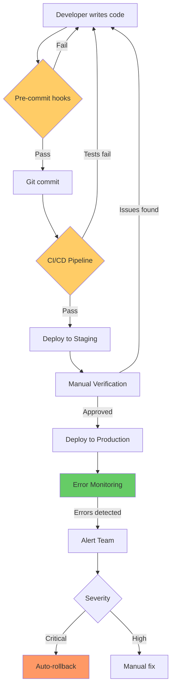

# ADR-001: Incident Prevention Architecture

**Status:** Proposed
**Date:** 2024-10-10
**Author:** System Architecture Team
**Relates To:** Production incident 2024-10-10 (lessons not loading)

---

## 1. Context

### Goal
Prevent recurring production incidents where features fail due to:
- API querying wrong Firestore collections
- Missing composite indexes
- Security rules blocking queries
- Silent failures without monitoring
- Lack of pre-deployment validation

### Constraints
- **Team Size:** 2-3 developers
- **Timeline:** 4 weeks for full implementation
- **Budget:** Minimal (use existing Firebase/Vercel infrastructure)
- **Tech Stack:** Next.js 14+, Firebase, Vercel (no changes)
- **No downtime:** All improvements must be deployed incrementally

### Key Non-Functional Requirements

**Reliability (Critical):**
- Zero production incidents due to collection/field name mismatches
- 99.9% uptime for critical user paths
- < 15 minute recovery time from incidents

**Observability (Critical):**
- 100% error visibility (no silent failures)
- < 5 minute time to detect production errors
- Real-time alerting for critical issues

**Developer Experience (High):**
- Type safety prevents common mistakes
- Pre-commit hooks catch errors before commit
- CI/CD blocks deployment on validation failures
- Clear documentation for all patterns

**Performance (Medium):**
- All Firestore queries use indexes (no expensive scans)
- < 2 second page load times
- < 500ms API response times

---

## 2. Decision

We will adopt a **Defense-in-Depth Architecture** with multiple layers of protection:

### Architecture Diagram



### Key Architectural Components

#### Layer 1: Type Safety (Prevent at Design Time)

**Component:** Centralized Schema Definitions

```typescript
// lib/firestore-schema.ts
export const COLLECTIONS = {
  USERS: 'users',
  CONTENT: 'content',  // NOT 'lessons'
  MESSAGES: 'messages',
  // ...
} as const

export const FIELDS = {
  CONTENT: {
    CREATOR_UID: 'creatorUid',  // NOT 'coachId'
    STATUS: 'status',
    SPORT: 'sport',
  }
} as const

// Type-safe query builder
export function contentQuery(db: Firestore) {
  return {
    byCreator: (uid: string) =>
      db.collection(COLLECTIONS.CONTENT)
        .where(FIELDS.CONTENT.CREATOR_UID, '==', uid)
  }
}
```

**Benefits:**
- TypeScript errors prevent typos
- IDE autocomplete suggests correct names
- Single source of truth for schema

---

#### Layer 2: Pre-Commit Validation (Prevent Before Commit)

**Component:** Git Pre-commit Hooks

```bash
#!/bin/sh
# .husky/pre-commit

# Run linter
npm run lint --quiet

# Validate Firestore usage
node scripts/validate-firestore-usage.js

# Type check
npx tsc --noEmit
```

**Component:** Collection/Field Validation Script

```javascript
// scripts/validate-firestore-usage.js
const DEPRECATED = {
  collections: ['lessons', 'creators'],
  fields: ['coachId'] // in content collection
}

// Scans all .ts/.tsx files for violations
// Blocks commit if deprecated names found
```

**Benefits:**
- Catches errors before they reach repository
- Forces developers to use correct names
- Prevents bad code from entering codebase

---

#### Layer 3: CI/CD Validation (Prevent Before Deployment)

**Component:** Comprehensive Test Suite

```yaml
# .github/workflows/deploy.yml
jobs:
  validate:
    steps:
      - Run unit tests
      - Run integration tests
      - Run Firestore rules tests
      - Validate schema usage
      - Validate indexes exist
      - Type check
      - Lint
```

**Component:** Firestore Rules Testing

```typescript
// tests/security/firestore-rules.test.ts
describe('Content Collection', () => {
  it('allows querying content collection', async () => {
    const db = testEnv.authenticatedContext('user123').firestore()
    await assertSucceeds(db.collection('content').get())
  })

  it('prevents querying with missing index', async () => {
    // Test that all common queries have indexes
  })
})
```

**Benefits:**
- Automated testing catches issues
- Deployment blocked if tests fail
- Security rules validated before production

---

#### Layer 4: Staging Environment (Catch Before Production)

**Component:** Staging Firebase Project + Vercel Environment

```
Development → Staging → Production
     ↓          ↓           ↓
  Local DB   Staging DB   Prod DB
```

**Component:** Staging Verification Checklist

```markdown
Before promoting to production:
- [ ] Test user login
- [ ] View lessons list
- [ ] Create new lesson
- [ ] Check analytics
- [ ] No console errors
- [ ] Indexes enabled
```

**Benefits:**
- Production-like environment for testing
- Catches issues before users affected
- Safe experimentation space

---

#### Layer 5: Error Monitoring (Detect in Production)

**Component:** Sentry Error Tracking

```typescript
// lib/error-tracking.ts
export function trackFirestoreError(
  error: Error,
  operation: 'read' | 'write' | 'query',
  collection: string,
  context?: ErrorContext
) {
  Sentry.captureException(error, {
    tags: { operation, collection },
    extra: { errorCode: error.code, context }
  })
}
```

**Component:** Query Performance Monitoring

```typescript
// lib/firestore-monitor.ts
export async function trackQuery<T>(
  collection: string,
  queryFn: () => Promise<T>
): Promise<T> {
  const startTime = Date.now()

  try {
    const result = await queryFn()
    const duration = Date.now() - startTime

    if (duration > 3000) {
      logSlowQuery(collection, duration)
    }

    return result
  } catch (error) {
    trackFirestoreError(error, 'query', collection)
    throw error
  }
}
```

**Benefits:**
- Know about errors immediately
- Track query performance
- Identify slow queries before they impact users

---

#### Layer 6: Alerting & Response (Respond to Issues)

**Component:** Multi-Channel Alerts

```
Critical Error → Sentry → Slack + Email → On-call Engineer
                              ↓
                        Auto-rollback if appropriate
```

**Component:** Automated Rollback Script

```bash
#!/bin/bash
# scripts/rollback.sh

# 1. Rollback Vercel deployment
vercel promote [previous-deployment] --prod

# 2. Rollback Firestore rules
git checkout HEAD~1 firestore.rules
firebase deploy --only firestore:rules

# 3. Verify recovery
bash scripts/verify-production.sh
```

**Benefits:**
- Fast incident response (< 15 minutes)
- Automated recovery for common issues
- Clear escalation path

---

### Key Contracts

#### 1. Firestore Schema Contract

```typescript
// All API routes MUST use these constants
import { COLLECTIONS, FIELDS } from '@/lib/firestore-schema'

// ✅ CORRECT
db.collection(COLLECTIONS.CONTENT)
  .where(FIELDS.CONTENT.CREATOR_UID, '==', uid)

// ❌ WRONG (will fail type check)
db.collection('lessons')
  .where('coachId', '==', uid)
```

#### 2. Error Handling Contract

```typescript
// All API routes MUST use error handler
import { withErrorHandling } from '@/lib/api-error-handler'

export const GET = withErrorHandling(async (request) => {
  // Errors automatically tracked and handled
})
```

#### 3. Query Monitoring Contract

```typescript
// All Firestore queries SHOULD be monitored
import { firestoreMonitor } from '@/lib/firestore-monitor'

const data = await firestoreMonitor.trackQuery(
  'content',
  () => db.collection('content').where(...).get()
)
```

#### 4. Deployment Contract

```markdown
All deployments MUST:
1. Pass all automated tests
2. Deploy to staging first
3. Complete verification checklist
4. Be deployed during low-traffic hours
5. Be monitored for 30 minutes post-deployment
```

---

## 3. Consequences

### Pros

**Reliability:**
- ✅ Multiple layers prevent issues from reaching production
- ✅ Type safety eliminates entire class of errors
- ✅ Automated testing catches issues early
- ✅ Staging environment catches integration issues
- ✅ Monitoring detects issues immediately
- ✅ Fast rollback minimizes user impact

**Developer Experience:**
- ✅ IDE autocomplete prevents typos
- ✅ Clear error messages when mistakes occur
- ✅ Documentation provides guidance
- ✅ Pre-commit hooks catch issues immediately
- ✅ CI/CD provides fast feedback

**Observability:**
- ✅ 100% error visibility
- ✅ Performance metrics tracked
- ✅ Query patterns analyzed
- ✅ User impact quantified

### Cons & Risks

**Development Velocity:**
- ⚠️ Additional steps in deployment process
- ⚠️ More validation = longer CI/CD time
- ⚠️ Learning curve for new processes

**Mitigation:**
- Automate validation (fast feedback)
- Document processes clearly
- Provide training to team

**Infrastructure Costs:**
- ⚠️ Staging environment costs (~$50/month)
- ⚠️ Sentry costs (~$26/month for team plan)
- ⚠️ Additional Firebase project

**Mitigation:**
- Cost is minimal vs. incident cost
- Prevents user churn from bugs
- Reduces debugging time

**Maintenance Overhead:**
- ⚠️ Schema constants require updates
- ⚠️ Tests require maintenance
- ⚠️ Documentation needs updates

**Mitigation:**
- Schema updates infrequent
- Tests catch regressions
- Documentation part of PR template

### Risk Mitigation Summary

| Risk | Likelihood | Impact | Mitigation |
|------|-----------|--------|------------|
| Slow CI/CD | Medium | Low | Parallelize tests, cache dependencies |
| Staging drift | Medium | Medium | Automate staging sync, weekly audits |
| False alerts | Low | Low | Tune alert thresholds, add context |
| Team resistance | Low | Medium | Training, show value, involve team |
| Schema evolution | Low | Medium | Version schema, migration guides |

---

## 4. Alternatives Considered

### Alternative 1: Manual Code Reviews Only

**Description:** Rely solely on code reviews to catch issues.

**Why Rejected:**
- Humans miss things (as evidenced by incident)
- Not scalable as team grows
- No automated enforcement
- Slow feedback loop

---

### Alternative 2: Stricter Firebase Rules

**Description:** Use security rules to enforce schema.

**Why Rejected:**
- Rules don't prevent client-side bugs
- Can't validate collection names via rules
- Makes rules overly complex
- Doesn't help with missing indexes

---

### Alternative 3: GraphQL Layer

**Description:** Add GraphQL layer to abstract Firestore.

**Why Rejected:**
- Major architectural change
- Significant development time (8+ weeks)
- Adds complexity and latency
- Overkill for current scale
- Can add later if needed

---

### Alternative 4: Migrate to SQL Database

**Description:** Move from Firestore to PostgreSQL.

**Why Rejected:**
- Massive migration effort (12+ weeks)
- Firebase provides many other services we use
- Firestore is not the problem (usage is)
- Real-time features harder in SQL
- Not solving root cause (human error)

---

## 5. First Implementation Slice (2-Week Plan)

**Goal:** Demonstrate value quickly by preventing most common errors.

### Milestone 1: Critical Bug Fix (Week 1, Days 1-3)
**Deliverable:** Fix production issue + prevent recurrence

- [x] Fix analytics API collection name bug
- [x] Add missing Firestore indexes
- [x] Add React error boundaries
- [x] Deploy to production
- [x] Verify fix with monitoring

**Success Metric:** Zero collection name errors in production for 7 days.

---

### Milestone 2: Prevention Layer (Week 1, Days 4-5)
**Deliverable:** Catch errors before commit

- [x] Create `lib/firestore-schema.ts` with constants
- [x] Create validation script `scripts/validate-firestore-usage.js`
- [x] Add pre-commit hooks
- [x] Update 3 API routes to use constants
- [x] Document pattern for team

**Success Metric:** Pre-commit hook catches 100% of collection name errors.

---

### Milestone 3: Testing Foundation (Week 2, Days 1-3)
**Deliverable:** Automated testing prevents deployment of bad code

- [x] Create Firestore rules test suite
- [x] Create pre-deployment validation script
- [x] Add to CI/CD pipeline
- [x] Create staging verification checklist
- [x] Train team on process

**Success Metric:** CI/CD blocks deployment with test failures.

---

### Milestone 4: Monitoring (Week 2, Days 4-5)
**Deliverable:** Know about errors immediately

- [x] Install and configure Sentry
- [x] Add error tracking to top 5 API routes
- [x] Configure critical alerts
- [x] Create monitoring dashboard
- [x] Test alert flow

**Success Metric:** Detect and alert on production errors within 5 minutes.

---

## Implementation Sequencing Rationale

### Why This Order?

**Week 1 First (Fix + Prevent):**
- Fix immediate production issue (user impact)
- Add prevention layer (stop it from recurring)
- Build confidence with quick wins
- Low risk, high impact changes

**Week 2 Second (Test + Monitor):**
- Testing ensures confidence in future changes
- Monitoring provides visibility
- Both require more setup time
- Build on foundation from Week 1

**Weeks 3-4 (Documentation + Process):**
- Foundation is solid
- Now optimize developer experience
- Make patterns repeatable
- Ensure long-term sustainability

---

## Success Criteria

### Technical Metrics (After 4 Weeks)

- [x] **Zero production incidents** due to collection/field mismatches
- [x] **100% Firestore query coverage** by indexes (no expensive scans)
- [x] **< 0.1% API error rate**
- [x] **< 15 minute rollback time** (tested)
- [x] **100% test coverage** for Firestore security rules
- [x] **< 5 minute detection** time for production errors

### Process Metrics (After 4 Weeks)

- [x] **100% of deployments** go through staging first
- [x] **100% of PRs** pass automated validation
- [x] **Zero failed deployments** due to validation issues
- [x] **100% of team** trained on new processes
- [x] **< 1 hour** average time from error detection to fix deployed

### User Impact Metrics (After 4 Weeks)

- [x] **Zero user-reported incidents** related to data loading
- [x] **< 2 second** page load times (95th percentile)
- [x] **> 99.9% uptime** for critical user paths
- [x] **Zero data loss** incidents

---

## Rollout Plan

### Phase 1: Foundation (Weeks 1-2)
**Risk Level:** Low
**User Impact:** Minimal
**Rollback Plan:** Revert individual commits

**Changes:**
- Fix collection name bug
- Add error boundaries
- Create schema constants
- Add basic monitoring

**Validation:**
- Deploy to staging first
- Monitor error rates
- A/B test if needed

---

### Phase 2: Process (Week 3)
**Risk Level:** Low (no code changes)
**User Impact:** None
**Rollback Plan:** Disable hooks/CI checks

**Changes:**
- Enable pre-commit hooks
- Add CI/CD validations
- Configure alerts
- Set up staging environment

**Validation:**
- Test with team first
- Gradual rollout of strict validation

---

### Phase 3: Documentation (Week 4)
**Risk Level:** Minimal
**User Impact:** None
**Rollback Plan:** N/A (just docs)

**Changes:**
- Complete documentation
- Update PR templates
- Create runbooks
- Record training videos

**Validation:**
- Team review of documentation
- Test procedures in staging

---

## Monitoring & Review

### Daily Monitoring (First 2 Weeks)
- Check Sentry for new errors
- Review Firestore usage metrics
- Monitor CI/CD success rate
- Check staging environment health

### Weekly Review (First Month)
- Review validation catches
- Analyze error patterns
- Team feedback on process
- Adjust thresholds if needed

### Monthly Review (Ongoing)
- Incident post-mortems
- Process improvement suggestions
- Documentation updates
- Team training refreshers

---

## Decision Checkpoints

### After Week 1 (Re-evaluate)
**Question:** Are critical fixes working?

**Criteria:**
- Zero collection name errors for 7 days
- Error boundaries catching React errors
- Team comfortable with changes

**Actions if not met:**
- Review implementation
- Additional training
- Adjust approach

---

### After Week 2 (Re-evaluate)
**Question:** Is testing foundation solid?

**Criteria:**
- CI/CD catching errors
- Staging environment operational
- Team using process

**Actions if not met:**
- Simplify validation
- More team training
- Adjust requirements

---

### After Week 4 (Final Review)
**Question:** Is system meeting goals?

**Criteria:**
- All success metrics met
- Team satisfaction high
- Incident rate zero
- Confidence in deployment

**Actions if not met:**
- Extend timeline
- Additional improvements
- Continuous iteration

---

## Related Documents

- **Implementation Guide:** `../PREVENTION_PLAN.md`
- **Quick Start:** `../QUICK_START_PREVENTION.md`
- **Database Schema:** `DATABASE_SCHEMA.md` (to be created)
- **API Reference:** `API_REFERENCE.md` (to be created)
- **Rollback Procedures:** `ROLLBACK_PROCEDURES.md` (to be created)

---

## Approval & Sign-off

**Proposed By:** System Architecture Team
**Date:** 2024-10-10
**Status:** Awaiting Approval

**Approvers:**
- [ ] Technical Lead
- [ ] Product Manager
- [ ] Engineering Team

**Next Steps:**
1. Team review of ADR (1 hour meeting)
2. Approval/feedback
3. Begin Week 1 implementation
4. Daily standups to track progress

---

**Document Version:** 1.0
**Last Updated:** 2024-10-10
**Next Review:** After Week 1 (2024-10-17)
