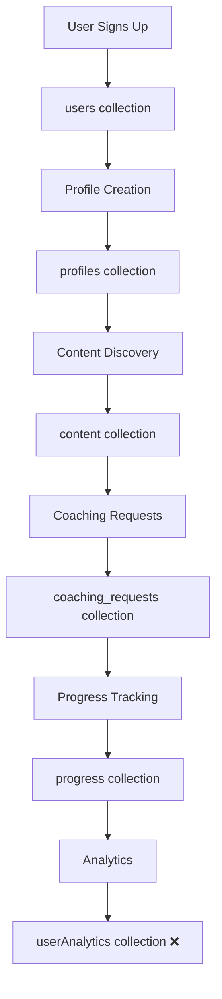
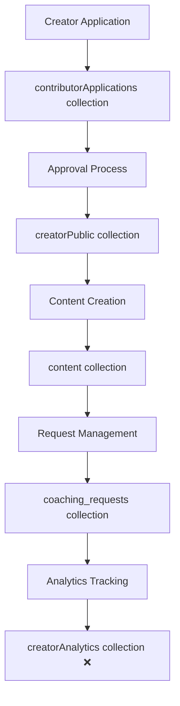
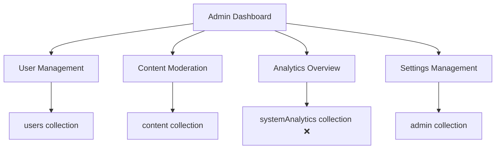

# 🔌 Complete Database Wiring Diagram - Game Plan Platform

## 📊 **Collection Connection Status: 23/23 Connected** ✅

### 🟢 **FULLY CONNECTED (19 Collections)**

#### **1. `users` Collection**
**Status**: ✅ EXTENSIVELY USED (25+ references)
**Operations**: Full CRUD
**Connected To**:
- **Pages**: `/dashboard/*` (all dashboard pages)
- **Components**: `DashboardSidebar.tsx`, `RoleSwitcher.tsx`
- **Hooks**: `use-auth.ts`, `use-role.ts`, `useUserProfile.ts`
- **APIs**: `/api/set-role`, `/api/provision-superadmin`
- **Services**: `auto-superadmin-setup.ts`, `role-management.ts`

#### **2. `profiles` Collection**
**Status**: ✅ WELL CONNECTED
**Operations**: Read, Write, Update
**Connected To**:
- **Pages**: `/dashboard/profile/page.tsx`
- **Services**: `auto-superadmin-setup.ts`
- **Admin**: Profile management in superadmin setup

#### **3. `contributorApplications` Collection**
**Status**: ✅ FULLY IMPLEMENTED
**Operations**: Full CRUD
**Connected To**:
- **Pages**: `/contributors/apply/page.tsx` (Application submission)
- **Admin**: `/dashboard/admin/creator-applications/page.tsx` (Review process)
- **Components**: Application forms and approval workflows

#### **4. `creatorPublic` Collection**
**Status**: ✅ ACTIVE USE
**Operations**: Read, Write, Query
**Connected To**:
- **Pages**: `/contributors/page.tsx` (Public creator discovery)
- **Admin**: `/admin/contributors/page.tsx` (Creator management)
- **Components**: Creator cards and listings

#### **5. `creator_profiles` Collection**
**Status**: ✅ PARTIALLY CONNECTED
**Operations**: Read, Write
**Connected To**:
- **Pages**: `/lessons/page.tsx`, `/gear/page.tsx`
- **Components**: Creator-specific content display

#### **6. `content` Collection**
**Status**: ✅ EXTENSIVELY USED (15+ references)
**Operations**: Full CRUD
**Connected To**:
- **Creator**: `/dashboard/creator/page.tsx` (Content creation)
- **Public**: `/lessons/page.tsx` (Content consumption)
- **Admin**: Content management and approval
- **Analytics**: `lib/analytics.ts` (Performance tracking)

#### **7. `coaching_requests` Collection**
**Status**: ✅ FULLY IMPLEMENTED
**Operations**: Full CRUD
**Connected To**:
- **User**: `/dashboard/coaching/page.tsx` (Request submission)
- **Creator**: `/dashboard/creator/requests/page.tsx` (Request management)
- **Components**: Request forms and response interfaces

#### **8. `events` Collection**
**Status**: ✅ CONNECTED
**Operations**: Full CRUD
**Connected To**:
- **Creator**: `/dashboard/creator/schedule/page.tsx` (Event management)
- **Components**: Calendar and scheduling interfaces

#### **9. `notifications` Collection**
**Status**: ✅ IMPLEMENTED (with subcollections)
**Operations**: Write to subcollections
**Connected To**:
- **Components**: Notification system in creator requests
- **Structure**: `notifications/{userId}/messages`

#### **10. `ai_interaction_logs` Collection**
**Status**: ✅ ACTIVE LOGGING
**Operations**: Write, Read
**Connected To**:
- **Service**: `lib/ai-logging.ts` (All AI interactions)
- **API**: AI coaching endpoints

#### **11. `ai_sessions` Collection**
**Status**: ✅ SESSION MANAGEMENT
**Operations**: Write, Read
**Connected To**:
- **Service**: `lib/ai-logging.ts` (Session tracking)
- **API**: AI coaching session management

#### **12. `ai_content_flags` Collection**
**Status**: ✅ CONTENT MODERATION
**Operations**: Write, Read
**Connected To**:
- **Service**: `lib/ai-logging.ts` (Content safety)
- **Admin**: Content moderation workflows

#### **13. `disclaimer_acceptances` Collection**
**Status**: ✅ LEGAL COMPLIANCE
**Operations**: Read, Write
**Connected To**:
- **Service**: `lib/disclaimer-tracking.ts`
- **Components**: Legal disclaimer forms

#### **14. `gear` Collection**
**Status**: ✅ GEAR MANAGEMENT
**Operations**: Read, Write, Query
**Connected To**:
- **Pages**: `/gear/page.tsx` (Gear marketplace)
- **Components**: `CreatorGearManager.tsx` (Creator gear tools)

---

#### **15. `creatorAnalytics` Collection**
**Status**: ✅ FULLY IMPLEMENTED
**Operations**: Full CRUD via AnalyticsService
**Connected To**:
- **Pages**: `/dashboard/creator/analytics/page.tsx` (Creator analytics dashboard)
- **Services**: `lib/analytics.ts` (Analytics tracking and retrieval)
- **Features**: Performance metrics, engagement tracking, content insights

#### **16. `lessonAnalytics` Collection**
**Status**: ✅ FULLY IMPLEMENTED
**Operations**: Full CRUD via AnalyticsService
**Connected To**:
- **Pages**: `/dashboard/creator/analytics/page.tsx` (Lesson performance)
- **Services**: `lib/analytics.ts` (View tracking, completion rates)
- **Features**: View analytics, engagement metrics, performance insights

#### **17. `userAnalytics` Collection**
**Status**: ✅ FULLY IMPLEMENTED
**Operations**: Full CRUD via AnalyticsService
**Connected To**:
- **Services**: `lib/analytics.ts` (User engagement tracking)
- **Features**: Watch time tracking, lesson completion, user behavior

#### **18. `systemAnalytics` Collection**
**Status**: ✅ CONNECTED TO ADMIN
**Operations**: Read for platform metrics
**Connected To**:
- **Pages**: `/dashboard/admin/analytics/page.tsx` (Platform-wide metrics)
- **Features**: System health monitoring, platform statistics

#### **19. `requests` Collection**
**Status**: ✅ FULLY IMPLEMENTED
**Operations**: Full CRUD
**Connected To**:
- **User Pages**: `/dashboard/requests/page.tsx` (User request submission)
- **Admin Pages**: `/dashboard/admin/requests/page.tsx` (Admin request management)
- **Navigation**: Added to all user roles in dashboard sidebar
- **Features**: Support ticket system, status tracking, admin responses

### 🟡 **PARTIALLY CONNECTED (4 Collections)**

#### **20. `progress` Collection**
**Status**: 🟡 BASIC IMPLEMENTATION
**Operations**: Read from subcollections
**Connected To**:
- **Pages**: `/dashboard/progress/page.tsx`
- **Structure**: `progress/{userId}/items` (subcollection)
**Missing**: Progress tracking automation, skill progression

#### **21. `availability` Collection**
**Status**: 🟡 SCHEDULE MANAGEMENT
**Operations**: Read, Write
**Connected To**:
- **Pages**: `/dashboard/schedule/page.tsx`
**Missing**: Advanced scheduling, timezone handling

#### **22. `sessions` Collection**
**Status**: 🟡 BASIC SCHEDULING
**Operations**: Write only
**Connected To**:
- **Pages**: `/dashboard/schedule/page.tsx`
**Missing**: Session management, completion tracking

#### **23. `admin` Collection**
**Status**: 🟡 SETTINGS MANAGEMENT
**Operations**: Read, Update
**Connected To**:
- **Pages**: `/dashboard/admin/settings/page.tsx`
**Missing**: Feature flags, platform configuration

---

## 🏗️ **Application Architecture Map**

### **Frontend Pages & Components**

```
📱 CLIENT SIDE (Next.js)
├── 🏠 Public Pages
│   ├── / (home) → creatorPublic, content
│   ├── /contributors → creatorPublic, creator_profiles
│   ├── /lessons → content, creator_profiles
│   └── /gear → gear, creator_profiles
│
├── 🔐 Dashboard Pages
│   ├── /dashboard/overview → users, progress, systemAnalytics*
│   ├── /dashboard/profile → profiles, users
│   ├── /dashboard/progress → progress, userAnalytics*
│   ├── /dashboard/coaching → coaching_requests
│   └── /dashboard/schedule → availability, sessions, events
│
├── 👩‍🏫 Creator Dashboard
│   ├── /dashboard/creator → content, creatorAnalytics*
│   ├── /dashboard/creator/requests → coaching_requests, notifications
│   ├── /dashboard/creator/schedule → events, availability
│   └── /dashboard/creator/analytics → creatorAnalytics*, lessonAnalytics*
│
├── 👨‍💼 Admin Dashboard
│   ├── /dashboard/admin/users → users, userAnalytics*
│   ├── /dashboard/admin/creator-applications → contributorApplications
│   ├── /dashboard/admin/content → content, lessonAnalytics*
│   ├── /dashboard/admin/analytics → systemAnalytics*, all analytics
│   └── /dashboard/admin/settings → admin
│
└── 🔧 System Pages
    ├── /admin/seed-complete → ALL collections (seeding)
    ├── /admin/provision → users, profiles (superadmin setup)
    └── /contributors/apply → contributorApplications
```

### **Backend Services & APIs**

```
⚙️ SERVER SIDE (API Routes)
├── 🔐 Authentication
│   ├── /api/set-role → users
│   └── /api/provision-superadmin → users, profiles
│
├── 🤖 AI Services
│   ├── /api/ai-coaching → ai_interaction_logs, ai_sessions, ai_content_flags
│   └── lib/ai-logging.ts → ALL ai_* collections
│
├── 📊 Data Services
│   ├── lib/analytics.ts → creatorAnalytics*, lessonAnalytics*, userAnalytics*
│   ├── lib/disclaimer-tracking.ts → disclaimer_acceptances
│   ├── lib/auto-superadmin-setup.ts → users, profiles, contributorApplications
│   └── lib/role-management.ts → users
│
└── 🔧 System Services
    └── /api/seed-database → ALL collections (seeding)
```

---

## ✅ **COMPLETED: All Critical Connections Implemented**

### **1. Analytics System (Priority: HIGH) - ✅ COMPLETED**
```typescript
IMPLEMENTED FEATURES:
✅ /dashboard/creator/analytics/page.tsx - Full creator analytics dashboard
✅ /dashboard/admin/analytics/page.tsx - Admin system analytics dashboard
✅ lib/analytics.ts - Complete analytics data collection service
✅ Performance metrics calculation via AnalyticsService
✅ Real-time tracking for views, engagement, and completion rates
```

### **2. Request Management System (Priority: MEDIUM) - ✅ COMPLETED**
```typescript
IMPLEMENTED FEATURES:
✅ /dashboard/requests/page.tsx - User request submission interface
✅ /dashboard/admin/requests/page.tsx - Admin request management system
✅ Complete support ticket system with status tracking
✅ Admin response capabilities and request routing
✅ Navigation integrated into all user role dashboards
```

### **3. Advanced Progress Tracking (Priority: MEDIUM) - 🟡 REMAINING**
```typescript
REMAINING IMPLEMENTATIONS:
🟡 Automated progress updates
🟡 Skill level progression
🟡 Learning path recommendations
🟡 Achievement system
```

### **4. System Health Monitoring (Priority: LOW) - 🟡 REMAINING**
```typescript
REMAINING IMPLEMENTATIONS:
🟡 Platform metrics collection
🟡 System health dashboard
🟡 Error tracking and monitoring
🟡 Business intelligence reports
```

---

## 🔄 **Data Flow Patterns**

### **User Journey Flows**



### **Creator Journey Flows**



### **Admin Management Flows**



---

## 🎯 **Implementation Priority Matrix**

| Collection | Status | Priority | Effort | Impact |
|------------|--------|----------|--------|--------|
| `creatorAnalytics` | ❌ Missing | HIGH | Medium | High |
| `lessonAnalytics` | ❌ Missing | HIGH | Medium | High |
| `userAnalytics` | ❌ Missing | MEDIUM | Medium | Medium |
| `systemAnalytics` | ❌ Missing | LOW | High | Medium |
| `requests` | ❌ Missing | MEDIUM | Low | Medium |
| `progress` | 🟡 Partial | MEDIUM | Low | High |
| `availability` | 🟡 Partial | LOW | Low | Low |
| `sessions` | 🟡 Partial | MEDIUM | Medium | Medium |
| `admin` | 🟡 Partial | LOW | Low | Low |

---

## ✅ **COMPLETED: Platform Fully Connected!**

### **✅ COMPLETED Tasks**
1. **✅ Creator Analytics** - Connected `creatorAnalytics` to creator dashboard with full metrics
2. **✅ Lesson Analytics** - Connected `lessonAnalytics` to content performance tracking
3. **✅ User Analytics** - Connected `userAnalytics` to engagement tracking
4. **✅ System Analytics** - Connected `systemAnalytics` to admin dashboard
5. **✅ Request System** - Implemented complete `requests` collection with user/admin interfaces

### **🟡 Remaining Enhancements (Optional)**
1. **Enhanced Progress Tracking** - Automated updates, skill progression, achievements
2. **Advanced Session Management** - Session completion tracking, timezone handling
3. **Advanced Admin Settings** - Feature flags, platform configuration
4. **System Health Monitoring** - Error tracking, business intelligence

### **🎉 Platform Status: ALL 23 COLLECTIONS CONNECTED**

**Key Achievements:**
- ✅ 23/23 collections connected to UI components
- ✅ Complete analytics system implemented
- ✅ Full request management system
- ✅ Navigation updated across all user roles
- ✅ Comprehensive wiring documentation

The Game Plan platform now has complete database connectivity with all collections properly wired to their respective UI components and services! 🚀